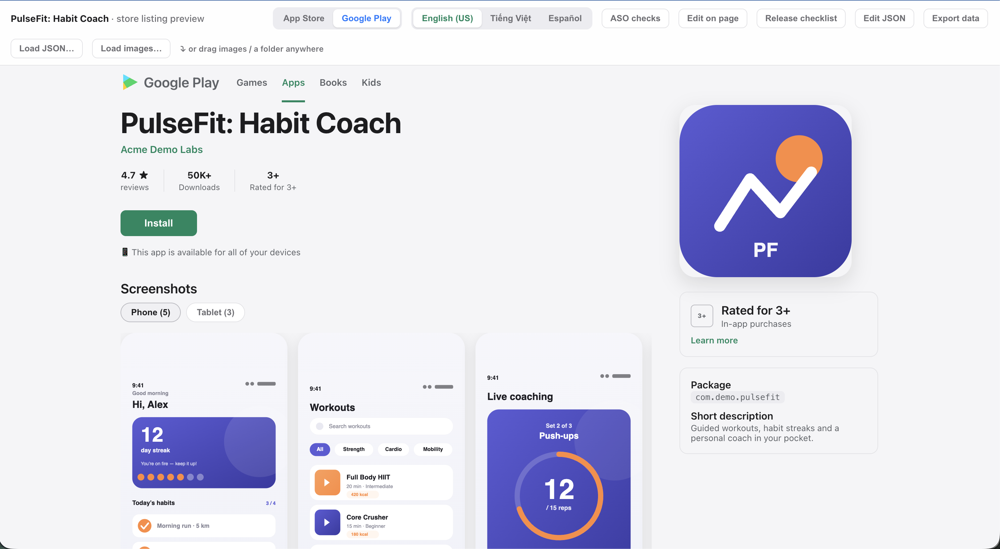

# App Preview

One local **site** to assemble, preview, and QA an **App Store** / **Google Play**
listing before you ship — a landing page, an interactive Playground tool, and full
docs, served together by `run.sh`.

> **🔗 Live docs:** **https://fighttechvn.github.io/app_marketing/**
> (deployed from [fighttechvn/app_marketing](https://github.com/fighttechvn/app_marketing) via GitHub Pages)



## What it does

- **Load from the stores** — pull screenshots + metadata text from App Store Connect
  and Google Play with your API keys (**Sync**).
- **Preview the new version** — see exactly how your **New** version looks on both
  stores; diff it against **Current** (**Review Diff**).
- **First-release checklist** — built-in checklist covering everything a first
  submission needs.
- **Store SEO audit (ASO)** — per-store, per-locale title/subtitle/keyword checks.
- **Verify keys** — test your ASC key + Play service account against the live APIs
  before saving them.
- **Dark theme** and **multi-language** landing + docs (en, vi, ko, ar, ja).

## Run the whole site

```bash
./run.sh            # builds the docs once, then serves everything on one origin
./run.sh --build    # force-rebuild the docs
```

It prints every route:

| Route | What |
| --- | --- |
| `/` | Landing page (product intro) |
| `/playground/` | The interactive store-preview tool |
| `/docs/` · `/docs/blog/` · `/docs/api/` | Docs, blog, interactive API reference |
| `/api/*` | Backend (Sync / Test / Apply-template) |

The server binds **127.0.0.1 only** because `/api/*` exposes store credentials.

## AI agent prompt (setup, run & load both stores)

Hand the whole flow — clone, run on localhost, and pull **text + screenshots**
from **App Store Connect + Google Play** — to an AI coding agent (Claude Code, etc.).
Copy-paste this:

```text
Repo: https://github.com/fighttechvn/app_marketing

Goal: run the App Preview Playground on localhost and load real listing TEXT +
SCREENSHOTS from BOTH stores (App Store Connect + Google Play).

1. Clone the repo (skip if present) and cd in.
2. Run `./run.sh` — it seeds .env from .env.example and serves on
   http://localhost:8092 (/, /playground/, /docs/, /api/*). Only python3 is required.
3. Confirm it's up: `curl -s http://localhost:8092/playground/ | head`.
4. Ask me for store credentials, then set them in .env:
   - App Store Connect: ASC_KEY_ID, ASC_ISSUER_ID, BUNDLE_ID, and either
     ASC_KEY_P8 (path) or ASC_KEY_P8_B64 (base64 of the .p8, one line).
   - Google Play: PLAYSTORE_PACKAGE_NAME, and either
     PLAYSTORE_SERVICE_ACCOUNT_JSON (path) or ..._B64 (base64 of the JSON).
   Restart run.sh after editing .env.
5. Load both stores: `curl -s http://localhost:8092/api/sync | python3 -m json.tool`
   → {"ok":true,"appstore":{"iphone":N,"ipad":N},"googleplay":{"phone":N},...}.
6. Verify: TEXT in listing-current.json (per-locale App Store + Google Play fields),
   SCREENSHOTS in assets/current/ (iphone-*.png, ipad-*.png, phone-*.png).
   Report the URL, the /api/sync JSON, and the file/screenshot counts.

Notes: server binds 127.0.0.1 only (creds under /api/*). /api/sync 500 "missing
ASC_KEY_ID…" = incomplete .env creds; 401/403 = key lacks access or wrong
BUNDLE_ID / PLAYSTORE_PACKAGE_NAME (use "Test keys" to isolate). /docs/ 404 is
harmless for Sync.
```

For a no-credentials smoke test, tell the agent to run `./run.sh`, open
`/playground/`, and use **Try template** (New variant) — no API keys needed.
The reusable Claude Code skill lives in
[.claude/skills/store-playground/](.claude/skills/store-playground/) (`SKILL.md` +
`AGENT_PROMPT.md`).

## Assets

| Folder | Variant | Filled by |
| --- | --- | --- |
| `assets/template/` | demo set (committed) | `gen-dummy.mjs` |
| `assets/new/` | **New** (runtime, gitignored) | **✨ Try template** · Load images · drag & drop |
| `assets/current/` | **Current** (runtime, gitignored) | **⟳ Sync** (live store API) |
| `assets/app-icon.svg`, `assets/feature-graphic.svg` | shared graphics | `gen-dummy.mjs` |

Regenerate the demo set:

```bash
node gen-dummy.mjs   # rewrites assets/template/* + app-icon.svg + feature-graphic.svg
```

Need real, store-spec screenshots in every size? See
**[Generate store screenshots (agent prompts)](docs/src/content/docs/guides/screenshot-prompts.md)**
for copy-paste prompts that drive an AI agent to capture and process them.

## Credentials (Sync / Test only)

The static preview, New/Current toggle, **Try template**, and **Review Diff** work
with **no credentials**. Only **Sync** and **Test keys** need API keys — see
[Get your API keys](docs/src/content/docs/guides/api-keys.md) and the
[environment variables reference](docs/src/content/docs/reference/env-variables.md).
Set them in `.env` (gitignored) or import them in the tool, then **Test keys**.

## Desktop app (macOS .dmg + Windows .exe)

Packaged as a native app with **Tauri + a Python sidecar**, for both platforms.

**Download:** grab the latest installer from
[Releases](https://github.com/fighttechvn/app_marketing/releases/latest) —
`*.dmg` (macOS, signed & notarized) or `*-setup.exe` (Windows NSIS). Both
auto-update (File ▸ Check for Updates…). The `.exe` isn't Authenticode-signed
yet, so Windows SmartScreen may warn once → *More info ▸ Run anyway*.

**Build locally (macOS):**

```bash
cd desktop
bash scripts/setup-prereqs.sh    # one-time: Rust, PyInstaller, deps
bash scripts/build.sh            # → src-tauri/target/release/bundle/dmg/*.dmg
```

Windows installers are produced by CI on a `windows-latest` runner (PyInstaller
can't cross-compile the sidecar). Bumping the version in
`desktop/src-tauri/tauri.conf.json` on `main` auto-builds **both** platforms and
cuts a GitHub Release — see [.github/workflows/auto-release-dmg.yml](.github/workflows/auto-release-dmg.yml).

See [desktop/README.md](desktop/README.md) and the
[desktop-app guide](docs/src/content/docs/guides/desktop-app.md). Node is only used
to build the docs; the runtime is the bundled Python (`serve.py`) + the system WebView.

## Docs site (Astro Starlight)

```bash
cd docs && npm install && npm run dev    # http://localhost:4321/docs
```

Build + deploy details in [docs/README.md](docs/README.md). `.github/workflows/deploy.yml`
assembles the **full static site** (landing + Playground + docs) via
`scripts/build-pages.sh` and publishes it to **https://fighttechvn.github.io/app_marketing/**
(`/` landing, `/playground/` static tool, `/docs/` docs). The Playground's backend
features (Sync / Test / Try-template) need the local server, so they're inert on
Pages — for the full interactive tool, self-host via `run.sh` or the desktop app.

## Repo layout

```
home.html                landing page (/)
index.html · serve.py    the Playground tool + umbrella server
assets/template/         demo screenshots (committed)
screenshots/             marketing images (e.g. site-marketing-demo.png)
listing.json             New variant data (empty marker by default)
listing-current.json     Current variant data (empty until Sync)
listing-template.json    demo data for "Try template"
gen-dummy.mjs            regenerate the demo set
docs/                    Astro Starlight docs + blog
run.sh                   serve the whole site
```
