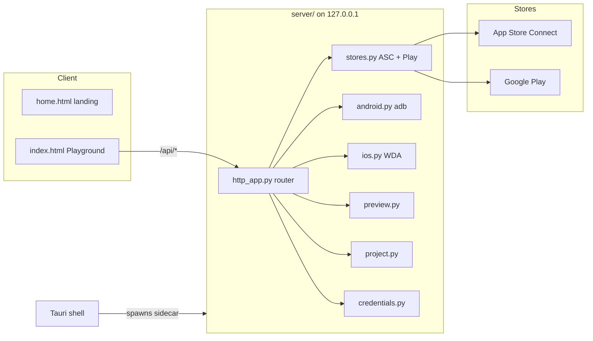
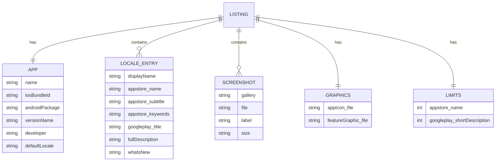

# Software Requirements Specification — App Preview

**Product:** App Preview (Store Listing Preview)
**Version:** 0.4.0
**Status:** Living document
**Owner:** fighttechvn / app_marketing
**Generated from:** `resources/user-story/`, `resources/technial-design/`, `resources/screens/` (authored with the `add-feat` + `add-srs` skills)

---

## 1. Introduction

### 1.1 Purpose
App Preview is a local-first tool to **assemble, preview, diff, and QA an App Store / Google Play listing before you ship it**. This SRS captures the product's requirements, user stories, use cases, screens, data model, non-functional requirements, risks, and test traceability.

### 1.2 Scope
- **In scope:** listing preview/edit for both stores, live store sync (read), Current→New diffing, ASO/character-limit audit, first-release checklist, credential test/import/export, live device mirroring, and signed desktop distribution with auto-update.
- **Out of scope:** writing/uploading metadata or screenshots back to the stores, the user's own app build signing, payments, analytics.

### 1.3 Definitions
| Term | Meaning |
|---|---|
| Listing | The full set of store metadata + screenshots + graphics for an app (the `DATA` object / `listing*.json`). |
| New / Current | The version being prepared (editable) vs the version live on the store (read-only, from Sync). |
| ASO | App Store Optimization — keyword/title/field tuning for store search. |
| Sync | Pulling the live listing from App Store Connect + Google Play. |
| Sidecar | The PyInstaller-bundled Python backend embedded in the desktop app. |
| WDA | WebDriverAgent, used to mirror/control a real iPhone. |

### 1.4 References
- `README.md`, `docs/` (Astro Starlight, live at https://fighttechvn.github.io/app_marketing/)
- `resources/feature-brief.md`
- OpenAPI: `docs/public/openapi.yaml`

---

## 2. Overall Description

### 2.1 Product perspective
A multi-surface product sharing one backend and one Playground UI:
- **Local site** (`run.sh`): landing + Playground + docs + `/api/*` on one `127.0.0.1` origin.
- **Static build** (GitHub Pages): preview-only Playground + docs (no backend; Sync/Test inert).
- **Desktop app** (Tauri + Python sidecar): native window hosting the Playground with full backend.

### 2.2 Architecture


### 2.3 User classes
- **Indie developer / first-time publisher** — needs the checklist + preview + key verification.
- **Release manager** — needs diff + ASO + multi-locale review per update.
- **Designer** — needs screenshot galleries + slot diff + device mirroring.
- **Maintainer** — builds and signs the desktop app.

### 2.4 Operating environment
- macOS (required for iOS sync, device mirroring, and desktop signing); Linux/Windows for the web tool and Android.
- Python 3 backend (stdlib `http.server` + PyJWT, cryptography, google-api-python-client, google-auth).
- Modern browser (vanilla JS, no framework). Node + Astro for building docs.

---

## 3. Requirements Summary

| ID | Requirement | Epic | Priority |
|---|---|---|---|
| FR-01 | Render a listing as an App Store and Google Play mockup, with New/Current variants and multi-locale. | EP01 | Must |
| FR-02 | Edit metadata in place, edit raw JSON, and add/auto-classify screenshots. | EP01 | Must |
| FR-03 | Sync the live listing (metadata + screenshots) from ASC + Play into Current. | EP02 | Must |
| FR-04 | Diff Current → New for text and screenshots with badges + lightbox. | EP03 | Must |
| FR-05 | Audit each field against store character limits per locale, live. | EP04 | Must |
| FR-06 | Provide a persisted first-release checklist with progress. | EP05 | Should |
| FR-07 | Test ASC + Play credentials without saving; import/export listing + self-contained `.env`. | EP06 | Must |
| FR-08 | Mirror and remote-control a connected Android device and iPhone; preview web/media/markdown. | EP07 | Should |
| FR-09 | Ship a signed/notarized desktop app (macOS/Windows) with auto-update and seeded app data. | EP08 | Should |

---

## 4. User Stories

Authoritative source files in `resources/user-story/`. Summary index:

| Story | Title | Epic |
|---|---|---|
| EP01.US001 | Preview a listing on both stores | EP01 |
| EP01.US002 | Switch between New and Current variants | EP01 |
| EP01.US003 | Edit metadata and assets in place | EP01 |
| EP01.US004 | View the listing per locale | EP01 |
| EP01.US005 | Dark mode and multi-language UI | EP01 |
| EP02.US001 | Sync the live App Store listing | EP02 |
| EP02.US002 | Sync the live Google Play listing | EP02 |
| EP02.US003 | See a clear sync result | EP02 |
| EP02.US004 | Keep credentials on the machine | EP02 |
| EP03.US001 | Diff metadata field-by-field | EP03 |
| EP03.US002 | Diff screenshots slot-by-slot | EP03 |
| EP03.US003 | Summarize and dismiss | EP03 |
| EP04.US001 | Audit field lengths against store limits | EP04 |
| EP04.US002 | See counts live while editing | EP04 |
| EP04.US003 | Catch empty required fields | EP04 |
| EP05.US001 | Work through a first-submission checklist | EP05 |
| EP05.US002 | Track progress | EP05 |
| EP05.US003 | Verify required assets and declarations | EP05 |
| EP06.US001 | Verify API keys without saving | EP06 |
| EP06.US002 | Import a listing or credentials | EP06 |
| EP06.US003 | Export a self-contained config | EP06 |
| EP07.US001 | Mirror and control an Android device | EP07 |
| EP07.US002 | Mirror and control an iPhone | EP07 |
| EP07.US003 | Preview web, media, and markdown | EP07 |
| EP08.US001 | Install and launch a native app | EP08 |
| EP08.US002 | Isolated, seeded app data | EP08 |
| EP08.US003 | Receive automatic updates | EP08 |
| EP08.US004 | Build and sign from source | EP08 |

---

## 5. Use Cases

### UC-01 Prepare and verify a release (primary flow)
**Actor:** Release manager · **Pre:** repo cloned, server running.
1. Add credentials → **Test keys** (EP06).
2. **Sync** the Current listing (EP02).
3. **Try template** or drag screenshots + edit text to build New (EP01).
4. Toggle **ASO checks** and trim over-limit fields (EP04).
5. **Review Diff** Current → New per locale (EP03).
6. Run the **Release checklist** (EP05).
7. **Export** JSON / `.env` for handoff (EP06).
**Post:** a verified New listing ready to paste into ASC / Play Console.

### UC-02 Verify credentials only
**Actor:** Developer. Paste `.env` → **Test keys** → per-store ✓/✗ → optionally **Save .env** (EP06).

### UC-03 QA on a real device
**Actor:** Designer. Open preview panel → pick Android/iPhone → **Live** → tap/swipe and capture (EP07).

### UC-04 Install and auto-update the desktop app
**Actor:** Any user. Install signed `.dmg`/installer → launch → **File ▸ Check for Updates** (EP08).

---

## 6. Screens / UI Surfaces

The ASCII layout documents below are injected from `resources/screens/*.md` by `resources/srs.sh`.

---

## 7. Data Model



Field-length limits (`DATA.limits`):

| Store | Field | Limit |
|---|---|---|
| App Store | name | 30 |
| App Store | subtitle | 30 |
| App Store | keywords | 100 |
| App Store | promotionalText | 170 |
| App Store | description | 4000 |
| App Store | whatsNew | 4000 |
| Google Play | title | 30 |
| Google Play | shortDescription | 80 |
| Google Play | fullDescription | 4000 |
| Google Play | changelog | 500 |

Persisted artifacts: `listing.json` (New), `listing-current.json` (Current), `listing-template.json` (demo), `assets/{template,new,current}/`, `.env`.

---

## 8. External Interfaces (API)

Backend on `127.0.0.1` (from `server/http_app.py`):

| Method | Endpoint | Purpose | Epic |
|---|---|---|---|
| GET | `/api/sync` | Pull live ASC + Play listing → `listing-current.json` | EP02 |
| GET | `/api/scan` | Scan project folder (creds/assets/listings) | EP01 |
| POST | `/api/open` | Switch active project folder | EP01 |
| POST | `/api/apply-template` | Copy demo assets → New | EP01 |
| GET | `/api/env` | Export sync-only `.env` (base64-inlined) | EP06 |
| POST | `/api/env` | Save imported `.env` (first-time / `?force=1`) | EP06 |
| POST | `/api/test` | Verify ASC + Play creds (no save) | EP06 |
| GET | `/api/adb/devices` | List Android devices | EP07 |
| GET | `/api/adb/screen` | Android screencap (PNG) | EP07 |
| POST | `/api/adb/input` | Android tap/swipe/text/key | EP07 |
| POST | `/api/adb/scrcpy` | Launch native scrcpy | EP07 |
| GET | `/api/wda/devices` | List iOS devices | EP07 |
| GET | `/api/wda/status` | WDA status | EP07 |
| GET | `/api/wda/screen` | iOS screenshot (PNG) | EP07 |
| GET | `/api/wda/mjpeg` | iOS MJPEG stream | EP07 |
| POST | `/api/wda/input` | iOS tap/swipe/text/button/lock | EP07 |
| POST | `/api/wda/launch` | Launch WDA via xcodebuild | EP07 |
| GET | `/api/preview-file` | Serve local media/markdown | EP07 |

---

## 9. Non-Functional Requirements

| ID | Category | Requirement |
|---|---|---|
| NFR-01 | Security | Backend binds `127.0.0.1` only; credentials never leave the device; only `SYNC_KEYS` are exportable (no signing/Firebase secrets). |
| NFR-02 | Privacy | `/api/test` never persists; `/api/env` POST refuses to overwrite without `?force=1`; `.env`, `assets/new`, `assets/current` are gitignored. |
| NFR-03 | Usability | Preview works offline with no keys; dark theme + 5-language landing (en/vi/ko/ar-RTL/ja); no flash of wrong theme. |
| NFR-04 | Performance | Inline edits update without full re-render (caret preserved); screenshots lazy-load; device mirror reports FPS; MJPEG with polling fallback. |
| NFR-05 | Portability | Single-file frontend, stdlib-based backend, PyInstaller sidecar; desktop on macOS + Windows. |
| NFR-06 | Reliability | Missing external tools (adb/scrcpy/iproxy/xcodebuild) and missing creds degrade gracefully with readable status. |
| NFR-07 | Distribution | Desktop artifacts are signed + notarized and auto-update via a cryptographically verified `latest.json`. |
| NFR-08 | Maintainability | Backend split by concern under `server/`; docs in Astro; demo assets regenerable via `gen-dummy.mjs`. |

---

## 10. Risks

| Risk | Impact | Mitigation |
|---|---|---|
| ASC JWT / key misconfig | Sync fails | `/api/test` dry-run before save; readable error details. |
| Play edit session left open | Stuck edits | Test + sync always delete the edit session. |
| Credential leakage via export | Secret exposure | Export limited to `SYNC_KEYS`; explicit "keep private" warning; localhost-only. |
| iOS mirroring setup complexity | Feature unusable | One-click WDA launch + setup helper with go-ios commands. |
| Static Pages build has no backend | Sync/Test appear broken | Docs state preview-only; full tool requires `run.sh`/desktop. |
| Desktop update signature mismatch | Failed/blocked update | Tauri updater verifies signature before install. |

---

## 11. Traceability

| Requirement | Epic | User stories | Technical design | Screen | Verification |
|---|---|---|---|---|---|
| FR-01 | EP01 | US001–US002,004,005 | `technial-design/ep01-store-preview.md` | `screens/ep01-store-preview-screen.md` | `./run.sh` → toggle stores/variants/locales |
| FR-02 | EP01 | US003 | ep01 | ep01 screen | drag images, edit fields, Download listing.json |
| FR-03 | EP02 | US001–US004 | ep02 | ep01 screen (⟳ Sync) | `curl /api/sync` |
| FR-04 | EP03 | US001–US003 | ep03 | ep03 screen | Review Diff after Sync + edit |
| FR-05 | EP04 | US001–US003 | ep04 | ep04 screen | toggle ASO, type past a limit |
| FR-06 | EP05 | US001–US003 | ep05 | ep05 screen | tick items, reload (persistence) |
| FR-07 | EP06 | US001–US003 | ep06 | ep06 screen | `curl /api/test`, `/api/env` |
| FR-08 | EP07 | US001–US003 | ep07 | ep07 screen | `curl /api/adb/devices`, `/api/wda/devices` |
| FR-09 | EP08 | US001–US004 | ep08 | (native frame of ep01) | `./run_desktop.sh`, `./appdist.sh` |

---

## 12. Build & Run

```bash
# Local full site (landing + playground + docs + /api/*)
./run.sh
./run.sh --build      # force-rebuild docs

# Backend only
python3 serve.py 8092

# Desktop app
cd desktop && bash scripts/setup-prereqs.sh && ./run_desktop.sh

# Regenerate this SRS
./resources/srs.sh
```
