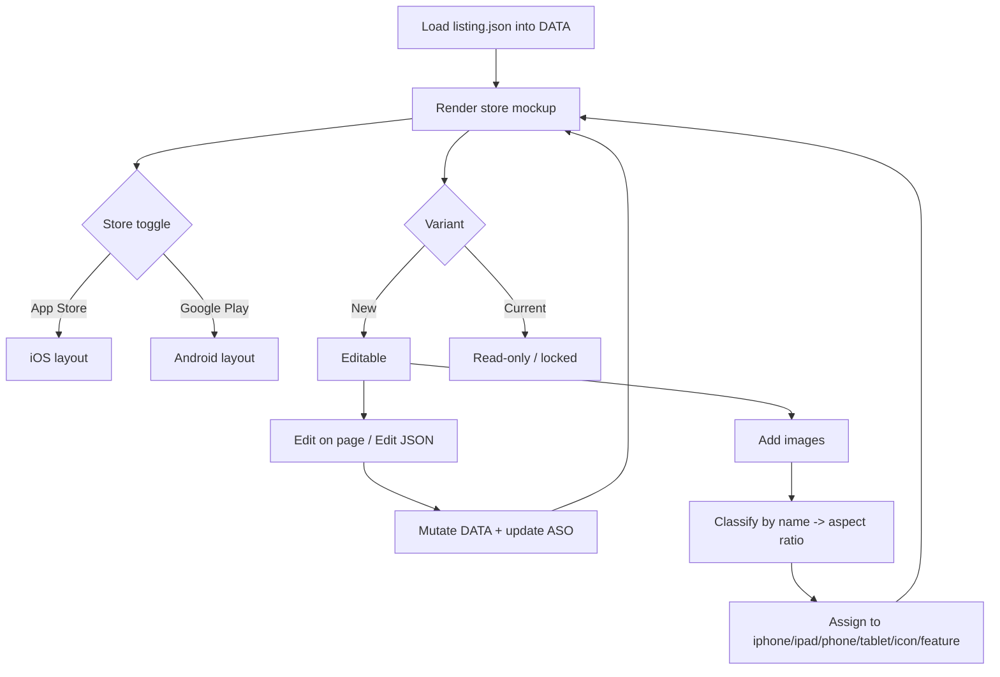

# EP01 Technical Design: Store Listing Preview

## Technologies
- Vanilla JS + DOM rendering in a single file `index.html` (~117 KB), no framework.
- CSS variables for theming (`--bg`, `--panel`, `--line`, `--text`, `--muted`, `--accent`, `--soft`); dark mode + `localStorage` persistence.
- Client-side state object `DATA` (the listing); `localStorage` for theme/locale and SAVED copy.
- Backend assist (optional): `POST /api/open`, `POST /api/apply-template` from `server/project.py`.

## Screen Layout
- Source: `resources/screens/ep01-store-preview-screen.md`
- Type: split control-bar + store-mockup wireframe (App Store and Google Play modes).

## Entry Points
- `index.html` — Playground UI, control bar, store mockups, inline edit, JSON editor, image drag-drop/classification.
- `home.html` — landing page + embedded Playground iframe.
- `listing.json` (New), `listing-current.json` (Current), `listing-template.json` (demo).
- `server/project.py` — `apply_template()`, `scan()`, `open_folder()`.
- `gen-dummy.mjs` — generates the demo SVG screenshots, app icon, feature graphic.

## Flow
1. Page loads `listing.json` (or empty placeholder) into `DATA`.
2. User picks store (App Store / Google Play) and variant (New / Current).
3. Renderer paints the matching mockup from `DATA[store]` + `DATA.screenshots`.
4. User switches locale → re-render text/screenshots/ASO for that locale.
5. "Edit on page" makes fields `contenteditable`; input events mutate `DATA` in place.
6. Images are added (button / drag-drop / directory) → auto-classified by filename then aspect ratio → assigned to the matching gallery.
7. Current variant is locked read-only; New variant edits persist to `listing.json` on download/save.

## Flow Diagram


## Entities
| Entity | Purpose | Key fields |
|---|---|---|
| Listing (`DATA`) | The whole config | `app`, `limits`, `locales`, `screenshots`, `graphics`, `aso` |
| App | App-level metadata | `name`, `androidPackage`, `iosBundleId`, `versionName/Code`, `icon`, `developer`, `rating`, `downloads`, `age`, `locales`, `defaultLocale`, `_variant` |
| LocaleEntry | Per-locale copy | `displayName`, `appstore{name,subtitle,keywords,promotionalText}`, `googleplay{title,shortDescription}`, `fullDescription`, `whatsNew` |
| Screenshot | One gallery image | `file`, `label`, `size` (galleries: `iphone`, `ipad`, `phone`, `tablet`) |
| Graphics | Store graphics | `appIcon{status,spec,file,size}`, `featureGraphic{…}` |

## Tests
- Functional walkthrough: store toggle, variant toggle, locale switch, inline edit caret retention, image auto-classification buckets.
- Verify Current is non-editable; New persists via Download listing.json.
- Cross-check character counters against `limits` (see EP04).
- Traceability: covered by SRS §Screens and §Traceability.

## Verification
```bash
./run.sh            # serve playground at /playground/
# open /playground/, toggle stores/variants/locales, drag images, edit fields
```
