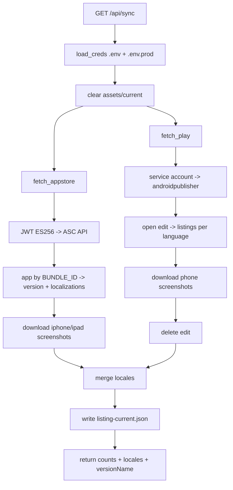

# EP02 Technical Design: Store Sync

## Technologies
- Python stdlib `http.server` backend (`server/http_app.py`).
- App Store Connect API + JWT (PyJWT, ES256) for iOS.
- Google API client (`google-api-python-client`, `google-auth`) Android Publisher v3 for Android.
- `server/util.py download()` for screenshot files.

## Screen Layout
- Triggered from the control bar ⟳ Sync button (see `resources/screens/ep01-store-preview-screen.md`).

## Entry Points
- `server/http_app.py:do_GET` → `/api/sync`.
- `server/stores.py` — `fetch_appstore()`, `fetch_play()`, `sync()`, `asc_token()`, `asc_get()`.
- `server/credentials.py` — `load_creds()`, `asc_p8_from()`, `play_sa()`.
- `server/context.py` — `root()`, `cur()` (the `assets/current/` dir).
- Output: `listing-current.json`, `assets/current/*.png`.

## Flow
1. `load_creds()` merges `{project}/.env` then `{APP_DIST}/.env.prod` into the environment.
2. `assets/current/` is created and old `(iphone|ipad|phone)-NN.png` cleared.
3. `fetch_appstore()`: mint JWT → resolve app by `BUNDLE_ID` → latest version + per-locale localizations → download iPhone/iPad screenshots.
4. `fetch_play()`: service-account auth → open edit → list languages → per-language listing → download phone screenshots → delete edit.
5. Locales from both stores are unioned; the unified structure is written to `listing-current.json`.
6. Response returns counts + locales + versionName for the toast.

## Flow Diagram


## Entities
| Entity | Purpose | Source |
|---|---|---|
| ASC credentials | iOS auth | `ASC_KEY_ID`, `ASC_ISSUER_ID`, `ASC_KEY_P8`/`_B64`, `BUNDLE_ID` |
| Play credentials | Android auth | `PLAYSTORE_PACKAGE_NAME`, `PLAYSTORE_SERVICE_ACCOUNT_JSON`/`_B64` |
| SyncResult | API response | `{ok, appstore:{iphone,ipad}, googleplay:{phone}, locales[], versionName}` |
| CurrentListing | Written file | `listing-current.json` (same shape as EP01 Listing, `_variant: CURRENT`) |

## Tests
- Credential present/absent paths; preview-only (no keys) must not crash.
- ASC display-type mapping → iphone/ipad buckets; Play `phoneScreenshots` → phone bucket.
- en-US-only screenshot fetch; locale union across stores.
- Verify edit session is always deleted (no store writes).

## Verification
```bash
PORT=8092 python3 serve.py 8092 &
curl -s http://127.0.0.1:8092/api/sync | python3 -m json.tool
```
