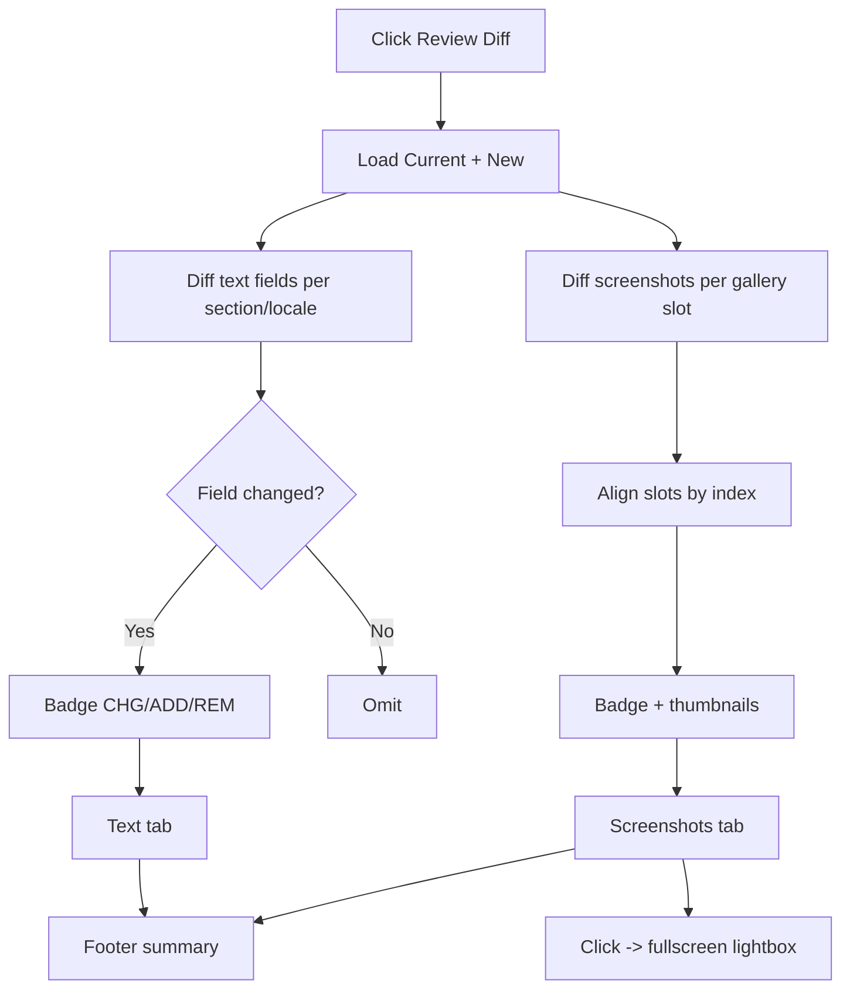

# EP03 Technical Design: Review Diff

## Technologies
- Client-side diff in `index.html` comparing the Current and New `DATA` objects.
- Modal/dialog UI reusing the shared `diff-overlay` styling; fullscreen lightbox.

## Screen Layout
- Source: `resources/screens/ep03-review-diff-screen.md`

## Entry Points
- `index.html` — "Review Diff" button, text diff builder, screenshot diff builder, lightbox.
- Inputs: `listing-current.json` (Current) and `listing.json` (New) loaded into memory.

## Flow
1. User clicks "Review Diff".
2. Build text diff: iterate App fields then each locale's fields; classify each as CHG/ADD/REM; skip unchanged.
3. Build screenshot diff: for each gallery, align slots by index; classify CHG/ADD/REM; mark missing slots.
4. Render two tabs (Text & metadata, Screenshots) + footer summary.
5. Clicking a thumbnail opens the lightbox (Esc / backdrop to close).

## Flow Diagram


## Entities
| Entity | Purpose | Fields |
|---|---|---|
| TextDiffRow | One field change | `section`, `field`, `oldValue`, `newValue`, `kind: CHG|ADD|REM` |
| ShotDiffRow | One slot change | `gallery`, `index`, `currentFile`, `newFile`, `kind` |
| DiffSummary | Footer totals | `textChanges`, `shotChanges` |

## Tests
- No Current synced → all New shots = ADD.
- Field added/removed/changed each map to the right badge.
- Gallery length mismatch handled (missing-slot placeholders).
- Lightbox open/close + caption correctness.

## Verification
```bash
# Sync to populate Current, edit New, then open Review Diff in the playground.
```
