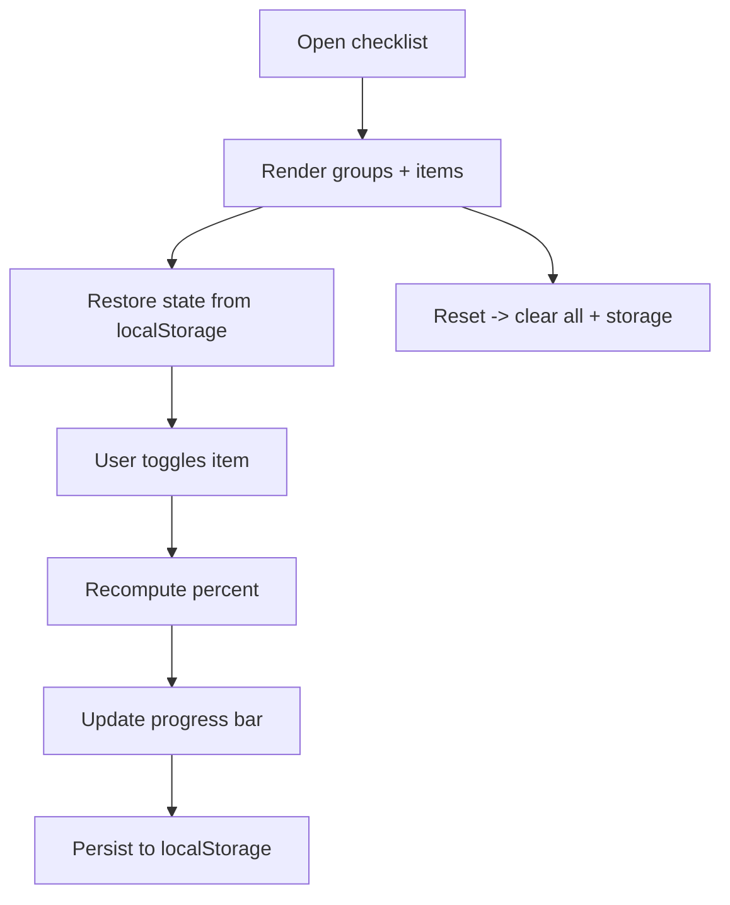

# EP05 Technical Design: First-Release Checklist

## Technologies
- Static checklist data + rendering in `index.html`.
- `localStorage` persistence (`store-release-checklist-v1`); live progress bar.

## Screen Layout
- Source: `resources/screens/ep05-release-checklist-screen.md`

## Entry Points
- `index.html` — "Release checklist" modal, grouped items, progress calc, reset.

## Flow
1. User opens the checklist modal.
2. Items render grouped by section with WEB UI / API / DECLARATION tags.
3. Toggling a checkbox updates the percent and persists to `localStorage`.
4. Reset clears all items and storage.

## Flow Diagram


## Entities
| Entity | Purpose | Fields |
|---|---|---|
| ChecklistGroup | Section | `title`, `items[]` |
| ChecklistItem | One gate | `id`, `label`, `tag: web|api|dec`, `checked` |
| Progress | Completion | `done`, `total`, `percent` |

## Groups
Accounts & signing · App records (one-time) · Listing content · Build · App Store version requirements · Submit · Known first-submission rejections.

## Tests
- Percent math at 0 / partial / 100%.
- Persistence across reload; Reset clears storage.
- Tag rendering (web/api/dec) correctness.

## Verification
```bash
# Open the playground, click Release checklist, tick items, reload to confirm persistence.
```
