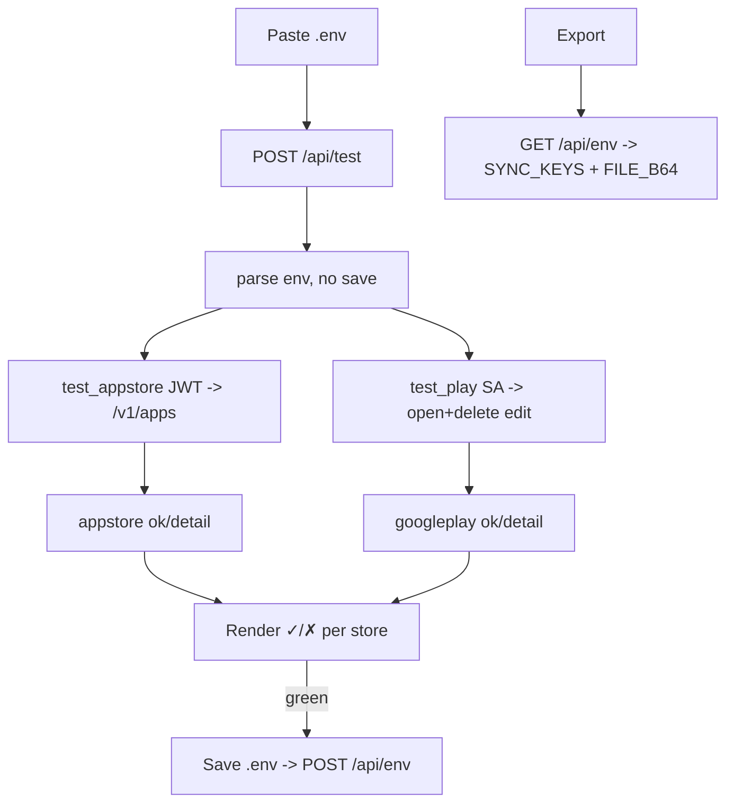

# EP06 Technical Design: Credentials, Import/Export & Key Verification

## Technologies
- Python backend `/api/env` (GET/POST) and `/api/test` (POST) in `server/http_app.py` + `server/stores.py`.
- `.env` parsing in `server/envfile.py`; base64 inlining of file-content keys.
- Client Import/Export modal in `index.html` (reuses the diff-overlay UI).

## Screen Layout
- Source: `resources/screens/ep06-credentials-screen.md`

## Entry Points
- `server/stores.py` — `test_creds()`, `test_appstore()`, `test_play()`, `env_dump()`.
- `server/credentials.py` — `load_creds()`, `asc_p8_from()`, `play_sa()`.
- `server/context.py` — `SYNC_KEYS`, `FILE_B64`.
- `index.html` — Import/Export tabs, "Test keys", "Save .env", "Load → Current".

## Flow
1. **Test:** client POSTs raw `.env` to `/api/test` → parse (no save) → `test_appstore()` + `test_play()` → `{ok, appstore:{ok,detail}, googleplay:{ok,detail}}`.
2. **Export:** client GETs `/api/env` → server returns only `SYNC_KEYS`, with `FILE_B64` keys (P8, SA JSON) base64-inlined.
3. **Import env:** client POSTs `.env` to `/api/env` → saved to `{project}/.env`, first-time-only unless `?force=1`.
4. **Import listing:** client parses pasted/file JSON → sets it as the read-only Current variant.

## Flow Diagram


## Entities
| Entity | Purpose | Fields |
|---|---|---|
| EnvExport | Self-contained creds | `ASC_KEY_ID`, `ASC_ISSUER_ID`, `ASC_KEY_P8_B64`, `BUNDLE_ID`, `PLAYSTORE_PACKAGE_NAME`, `PLAYSTORE_SERVICE_ACCOUNT_JSON_B64` |
| TestResult | Verify outcome | `{ok, appstore:{ok,detail}, googleplay:{ok,detail}}` |
| SaveResult | Import outcome | `{ok, saved, existed, path}` |

## Security
- `127.0.0.1` binding only; no TLS needed for localhost.
- Only `SYNC_KEYS` are ever exported — signing / Firebase / keystore secrets are excluded.
- `/api/test` never persists; `/api/env` POST refuses to overwrite without `?force=1`.

## Tests
- Valid vs invalid ASC key, issuer, bundle id; valid vs invalid SA JSON.
- Play edit session created then deleted on test.
- Export contains only sync keys; P8/SA inlined as base64.
- First-time save vs force overwrite.

## Verification
```bash
curl -s -X POST --data-binary @.env http://127.0.0.1:8092/api/test | python3 -m json.tool
curl -s http://127.0.0.1:8092/api/env | python3 -m json.tool
```
