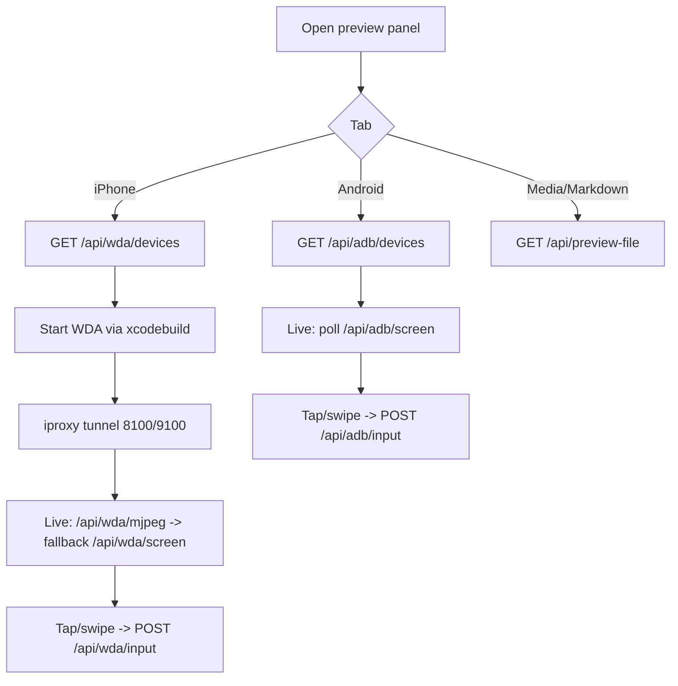

# EP07 Technical Design: Device Mirror & Remote Control

## Technologies
- Android: `adb` (screencap + input + keyevent), optional `scrcpy` for native high-FPS.
- iOS: WebDriverAgent over an `iproxy` USB tunnel (ports 8100 HTTP / 9100 MJPEG); `xcodebuild` launch; optional `go-ios`/libimobiledevice for discovery.
- Backend relays in `server/android.py`, `server/ios.py`, file preview in `server/preview.py`.
- Binary discovery via `server/util.py find_bin()`.

## Screen Layout
- Source: `resources/screens/ep07-device-mirror-screen.md`

## Entry Points
- `server/android.py` — `adb_devices()`, `adb_screen()`, `adb_input()`, `adb_scrcpy()`.
- `server/ios.py` — device list, `launch WDA`, `iproxy` tunnel, WDA session, screenshot, MJPEG, input.
- `server/preview.py` — `/api/preview-file` (media + markdown).
- `index.html` — preview panel: Android, iPhone, Web, Media, Markdown tabs.

## Flow
1. User opens the preview panel and a device tab.
2. Devices are listed (`/api/adb/devices`, `/api/wda/devices`).
3. "Live" streams frames (adb screencap polling, or WDA MJPEG with polling fallback).
4. Tap/swipe on the mirror maps to device coordinates and posts an input action.
5. Navigator buttons + text input send key/button/text events.
6. Web/Media/Markdown tabs render links, files, and docs via `/api/preview-file`.

## Flow Diagram


## Entities
| Entity | Purpose | Fields |
|---|---|---|
| AdbDevice | Android device | `serial`, `state`, `model`, `scrcpy` |
| IosDevice | iOS device | `udid`, `name`, `ios` |
| InputAction | Remote control | `action` (tap/swipe/text/key/button/lock), coords, `ms`, `text`, `key` |
| WdaStatus | WDA health | `running`, `size{w,h}`, `name`, `ios` |

## Tests
- Tool-missing paths (adb/scrcpy/iproxy/xcodebuild absent) return readable status, not crashes.
- Coordinate mapping (image px → device points for iOS, px for Android).
- MJPEG → polling fallback.
- `/api/preview-file` MIME detection for image/video/audio/markdown.

## Verification
```bash
curl -s http://127.0.0.1:8092/api/adb/devices | python3 -m json.tool
curl -s http://127.0.0.1:8092/api/wda/devices | python3 -m json.tool
```
