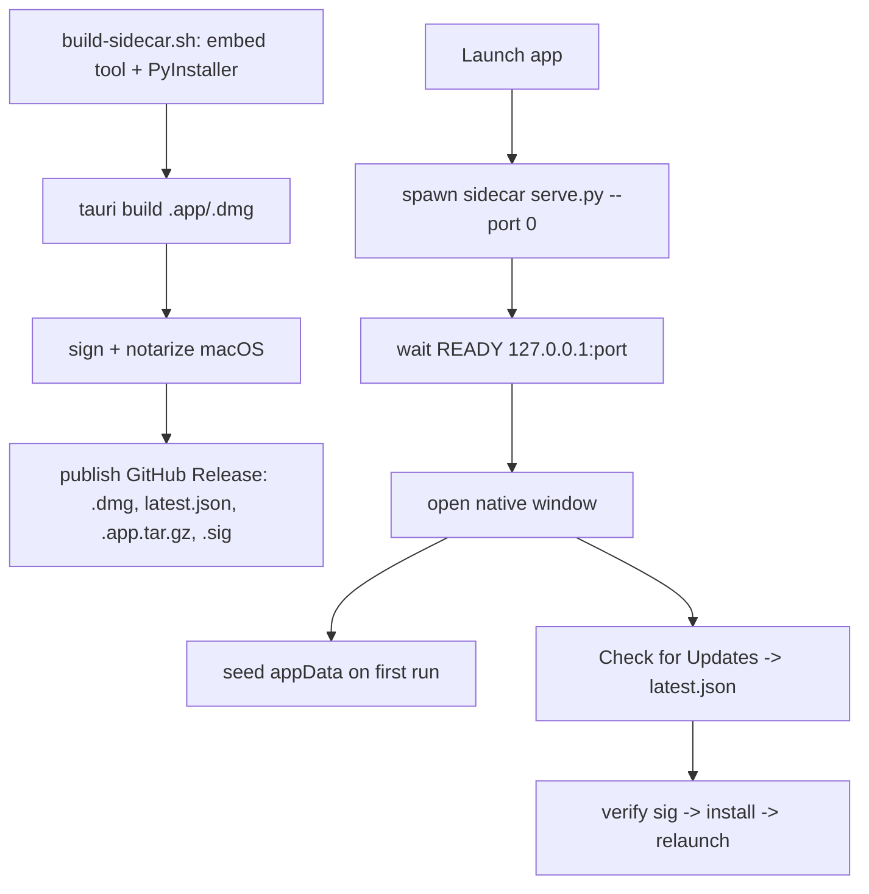

# EP08 Technical Design: Desktop App Distribution

## Technologies
- Tauri (Rust + system WebView) shell in `desktop/src-tauri/`.
- PyInstaller-built Python sidecar of the backend (`serve.py` + `server/`).
- macOS: Developer ID signing + notarization (ASC API key); Windows: NSIS installer.
- Tauri updater with a dedicated signing keypair; GitHub Releases for distribution.

## Screen Layout
- Native window hosting the Playground; native File/Edit menu (no custom ASCII screen — the UI is EP01 inside a native frame).

## Entry Points
- `desktop/src-tauri/tauri.conf.json` — productName `AppPreview`, identifier `vn.fighttech.appstorepreview`, version, updater config.
- `desktop/src-tauri/src/lib.rs` — spawn sidecar, wait for `READY`, open window, menu, updater.
- `desktop/scripts/build-sidecar.sh`, `build.sh`, `setup-prereqs.sh`, `setup-signing.py`.
- `desktop/run_desktop.sh` (dev), `deploy.sh`, `appdist.sh` (release).
- `.github/workflows/release-dmg.yml` (CI build/sign/publish).

## Flow
1. Build: embed Playground → PyInstaller sidecar binary → `tauri build` → `.app`/`.dmg` (+ NSIS on Windows).
2. Sign + notarize (macOS) using `.signing/` assets.
3. Launch: Tauri spawns the sidecar (`serve.py --port 0 --data-dir <appData>`) → waits for `READY http://127.0.0.1:<port>/` → opens window.
4. First run seeds the per-user app-data dir from the bundle.
5. Update: read `latest.json` from GitHub Release → verify signature → download → install → relaunch.

## Flow Diagram


## Entities
| Entity | Purpose | Fields |
|---|---|---|
| TauriConfig | App identity + updater | `productName`, `identifier`, `version`, updater endpoints + pubkey |
| Sidecar | Bundled backend | PyInstaller binary `serve-<triple>` |
| UpdateManifest | Auto-update | `latest.json` (version, url, signature) |
| SigningAssets | Code signing | `signing.env`, `DeveloperID.p12`, `AuthKey_*.p8` |

## Tests
- Sidecar spawns and `READY` is detected; window opens to the Playground.
- App-data seeding on first run; edits survive an update.
- Signed/notarized artifact opens without Gatekeeper/SmartScreen warnings.
- Updater verifies signature before install.

## Verification
```bash
cd desktop
bash scripts/setup-prereqs.sh      # one-time
./run_desktop.sh                   # dev window
./appdist.sh --skip-build <tag>    # reuse build, publish
```
